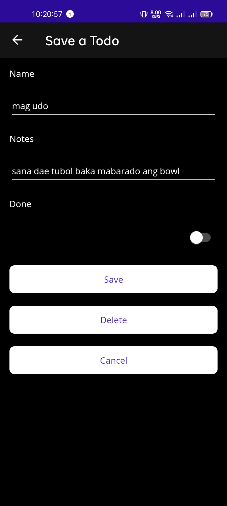
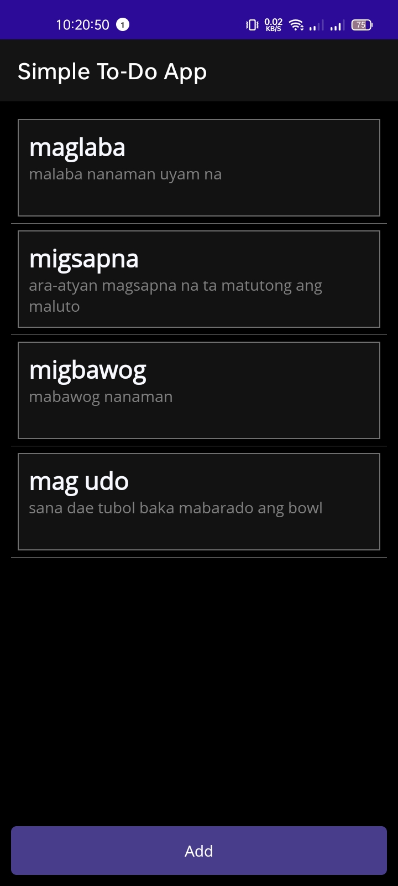
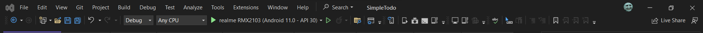

# SimpleTodo - A Minimalistic To-Do Mobile App
SimpleTodo is a straightforward to-do list mobile app built using .NET MAUI and C#. It utilizes SQLite for data storage, making it easy to manage your tasks on the go.

## App Preview 

## Setup Instructions
To get started with SimpleTodo, follow these steps:

### 1. Install Visual Studio Community 2022
Ensure that you have Visual Studio Community 2022 installed on your development machine. You can download it from the official website: [Visual Studio Community 2022](https://visualstudio.microsoft.com/downloads/).

### 2. Prepare Your Android Device
Before running the app on your Android device, make sure to:

- Enable Developer Options on your Android device. You can do this by going to "Settings" > "About Phone" > "Software Information" and tapping on the "Build Number" multiple times until Developer Options are enabled.

- Within Developer Options, enable "USB Debugging." This will allow you to deploy and test the app from Visual Studio.

- Set your Android device to "Transfer files / Android Auto" mode for better compatibility with Visual Studio.

### 3. Build and Run the App
Once your development environment is set up, follow these steps to run the SimpleTodo app:

- Launch Visual Studio Community 2022.

- Open the SimpleTodo project in Visual Studio.

- Connect your Android device to your computer via USB.

- Select your Android device from the available device options.

- Click the "Play" button or use the keyboard shortcut (F5) to build and deploy the app to your Android device.

- Now, you should see the SimpleTodo app running on your Android device, allowing you to manage your to-do list with ease.

If you encounter any issues or have feedback about the app, feel free to [report them on GitHub](https://github.com/ronhedwigzape/SimpleTodo) or reach out to the developer.

Happy task management with SimpleTodo!
